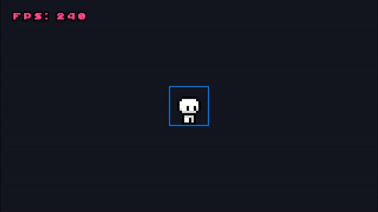

# RECS


<a href="./LICENSE"></a>
<a href="https://www.buymeacoffee.com/gabrielzschmitz" target="_blank"></a>
<a href="https://github.com/gabrielzschmitz/RECS"></a>

**RECS** is a lightweight, efficient Entity Component System (ECS) library
designed to integrate seamlessly with **[raylib](https://www.raylib.com)**. It
offers a simple, minimal foundation for building games and interactive
applications following the ECS architecture.

This repository contains both the **RECS library** itself and a concise example
showcasing a Conway Game of Life implementation using RECS alongside raylib.

---

## Quick Start

### 1. Clone the repository

```sh
git clone https://github.com/gabrielzschmitz/RECS.git
cd RECS
```

### 2. Build and run

Follow the platform-specific build and run instructions in
[INSTALL.md](INSTALL.md).

### 3. Explore the example

* **`src/engine`** — Core RECS ECS components, systems, and utilities
* **`src/entities`** — Sample game entities using RECS (e.g., Conway’s Game of
Life cells)
* **`resources`** — Assets like sprites and icons used in the example

---

## Features

* Minimal and easy-to-understand ECS design tailored for raylib
* Demonstrates Conway’s Game of Life simulation using RECS components and
systems

<p align="center">
  
</p>
<p align="center">
  <em>RECS simulates over 149,000 Conway’s Game of Life cells while maintaining 60+ FPS.</em>
</p>

---

## Usage

RECS serves as a lightweight ECS foundation for your raylib projects. Easily
extend components and systems or build entirely new gameplay on top of it to
suit your needs.

---

## License

This project is licensed under the MIT License. See the [LICENSE](LICENSE) file
for details.
